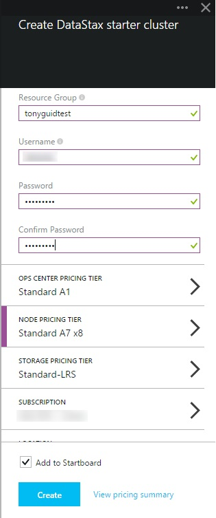
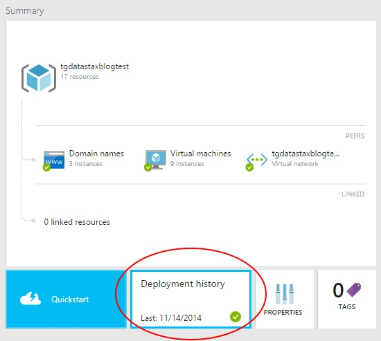
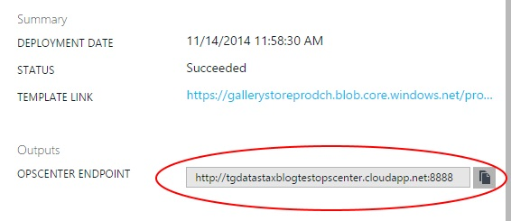
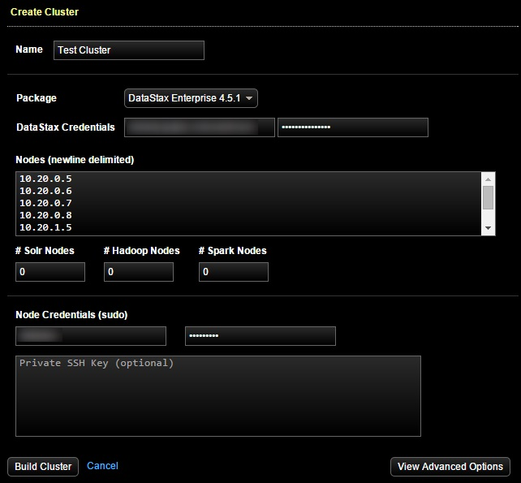
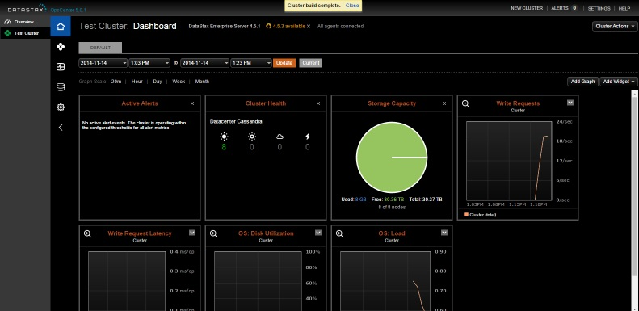

I've been deeply involved in the release of the Datastax marketplace announced on Scott Guthrie's blog [here](http://weblogs.asp.net/scottgu/azure-new-marketplace-network-improvements-new-batch-service-automation-service-more). 

One thing I have noticed is that there really doesn't seem to be any documentation as to what you should do <i>after</i> clicking the Create button. So I thiought I'd try to address this. Keep in mind this is not official documentation and that when in doubt, you should go to the [Datastax web site](http://www.datastax.com) or contact them directly.

#So, first things first - what gets deployed?

- 1 Opscenter VM
- 8 Data nodes

The nodes are inside a virtual network with 2 subnets, and each subnet contains 4 node VM's. Each node also has 4 1 TB drives of attached storage that are striped and partitioned to hold the Cassandra volume.

So, once you have entered the information into the portal and click create, all of this infrastructure is created for you. What isn't obvious is how to build this into an active Cassandra cluster. In order to do so, the first thing you have to do is go to the Opscenter application and build the cluster.

One other thing that is very non-obvious - the domain names and resource names are driven by the resource group name you give when creating the deployment.

#Building the cluster

To find out the URL to your Opscenter instance, you'll need to look into the output of the deployment in the Azure portal. You can get this by going to your resource group and clicking Deployment History:

 
And then click on the deployment and you will see what you need in the Output field. Copy and paste this into your browser window to go to the Opscenter application.

 

Before using Opscenter to build a cluster, you'll need to get a DatastaxId. Oddly,registering isn't available form the home page, you have to go to their [downloads](http://www.datastax.com/download) page to register.

Once you have reached the Opscenter application, click "Build New Cluster". Here you'll have to enter the IP's of the VM's in the cluster. This is another non-obvious element of this deployment. The VM's in subnet-1 range from 10.20.0.5-8, and the VM's in subnet-2 range from 10.20.1.5-8. these VM's need to be entered into the screen.

> Note: You're not required to use all 8 VM's. If you want to save some money and use fewer VM's, drop them in the Azure portal before building the cluster. However, it's important to note the IP's of the remaining VM's.

Finally, enter the admin id and password you entered when you created the deployment in the Azure portal.

Opscenter will run for a few minutes, and the result will be a single datacenter 8 node cluster, as shown in these screenshots below:

Now you are ready to begin using the cluster.

In a future post, I will show how to modify the cluster to create multiple Cassandra datacenters.

This is the first step of many improvements coming to getting toward a complete multi-datacenter deployment across multiple Azure regions. Stay tuned for future releases with continued improvements.

